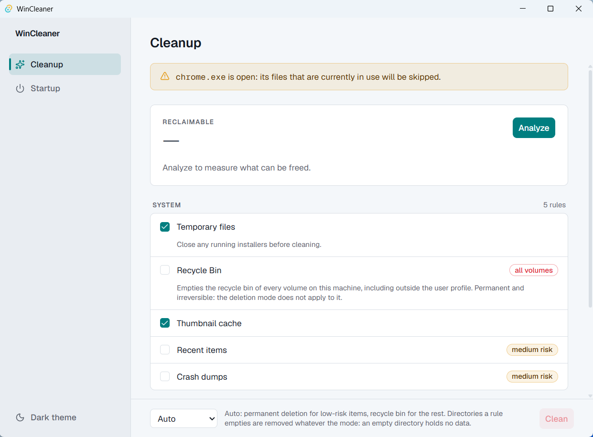

# WinCleaner

[](https://github.com/CaseReed/wincleaner/actions/workflows/ci.yml)
[](LICENSE)

An open source Windows cleaner that does only what it says: no telemetry, no
network access, no registry cleaner.



## Features

- **Ten audited built-in rules**, all declared in a single readable file
  (`src-tauri/rules.toml`) — nothing is hidden in the code.
- **Measure before you delete.** Analyze reports the reclaimable size per rule,
  with the exact list of files it would touch.
- **Two deletion modes plus Auto.** Auto sends low-risk items to permanent
  deletion and everything else to the recycle bin.
- **Startup manager.** Enable or disable what starts with your session, without
  ever deleting a registry value.
- **Light and dark themes**, including the Windows title bar.
- **No installer bloat.** A single Tauri 2 binary, ~10 MB, no runtime to
  install beyond WebView2, which Windows 11 already ships.

## What it cleans

Ten built-in rules across three categories, plus the community rules converted
from [Winapp2](https://github.com/MoscaDotTo/Winapp2), which are shown only
when the application they target is detected and are never checked by default.

| Category | Rule | Default | Risk |
| --- | --- | --- | --- |
| System | Temporary files (`%TEMP%`) | Checked | Low |
| System | Recycle Bin | **Unchecked** | Low |
| System | Thumbnail cache | Checked | Low |
| System | Recent items | **Unchecked** | Medium |
| System | Crash dumps (`%LOCALAPPDATA%\CrashDumps`) | **Unchecked** | Medium |
| Browsers | Microsoft Edge cache | Checked | Low |
| Browsers | Google Chrome cache | Checked | Low |
| Browsers | Mozilla Firefox cache | Checked | Low |
| Applications | npm cache (`%LOCALAPPDATA%\npm-cache`) | Checked | Low |
| Applications | pip cache (`%LOCALAPPDATA%\pip\Cache`) | Checked | Low |

The browser rules cover HTTP, code, GPU and service-worker caches only. Local
Storage, IndexedDB, Session Storage and service-worker registrations are
deliberately left alone: clearing them breaks offline mode for installed web
apps.

## Safety model

- **No command takes a path.** The front end only ever sends rule ids and a
  mode; cleaning always re-scans before deleting.
- **Profile containment verified on disk**, not merely declared: before walking
  a root, and again before every deletion, the path is resolved with
  `canonicalize` and must stay under the resolved `%USERPROFILE%`. Any
  junction, symbolic link, mount point or cloud sync placeholder is refused
  rather than followed, including at the root.
- **No registry cleaner.** The Startup screen writes only the enable bit of a
  startup program; it never deletes a registry value.
- **No network access.** The application CSP forbids it
  (`connect-src 'self' ipc: http://ipc.localhost`).
- **Confirmation before cleaning.** The Clean button always goes through a
  confirmation that announces the mode and names what the operation will
  destroy with no way back.

One exception deserves its own paragraph: the **Recycle Bin** rule goes through
the Windows `SHEmptyRecycleBinW` API, which empties the recycle bin of **every
volume** on the machine, including outside the user profile. That deletion is
permanent whatever the deletion mode chosen. The Cleanup screen flags it on the
rule row, the rule is **unchecked by default**, and it is always processed
first in a pass — otherwise it would permanently destroy what the other rules
had just dropped into the bin in "Recycle Bin" mode.

## Installation

Binaries (MSI and NSIS) are published on the repository
[Releases](https://github.com/CaseReed/wincleaner/releases) page.

These installers are **not signed yet**: Windows Defender SmartScreen will show
a warning, and a machine with Smart App Control (SAC) enabled will refuse to
run them until signing is in place. See [`docs/code-signing.md`](docs/code-signing.md)
for the state of the SignPath setup.

## Build from source

Prerequisites:

- Windows 11 with WebView2 installed
- Rust stable MSVC (rustup), Node 24 and npm 11
- Visual Studio 2022 with the C++ build tools

```
npm install
npm run tauri dev      # development
npm run tauri build    # installers in src-tauri/target/release/bundle
```

## Running the tests

```
npm test
cd src-tauri
cargo test -- --test-threads=1
```

`--test-threads=1` is mandatory on the Rust side: the startup registry tests
share `HKCU\Software\wincleaner-test`.

The checks that cannot be automated without destroying data (emptying the
recycle bin, actually disabling a startup program) are described in
[`docs/manual-verification.md`](docs/manual-verification.md) and are to be
replayed before every release.

## Contributing

Continuous integration (`.github/workflows/ci.yml`) runs on every pull request
targeting `main`: front-end tests (Vitest), front-end build, Rust tests
(`cargo test -- --test-threads=1`) and lint (`cargo clippy -D warnings`). A pull
request must pass those checks before review.

Adding a cleaning rule usually means editing `src-tauri/rules.toml` alone.
Paths may only use `%TEMP%`, `%LOCALAPPDATA%`, `%APPDATA%` and `%USERPROFILE%`,
and must resolve under the user profile — anything else is refused at load
time.

## Roadmap

- More application caches (package managers, IDEs, chat clients).
- On-demand elevation for the machine-wide startup entries and the common
  Startup folder, which are out of scope today.

## License

MIT — see [`LICENSE`](LICENSE).

The bundled [Winapp2](https://github.com/MoscaDotTo/Winapp2) rule base is
CC-BY-SA-4.0; see [`THIRD_PARTY_NOTICES.md`](THIRD_PARTY_NOTICES.md).
