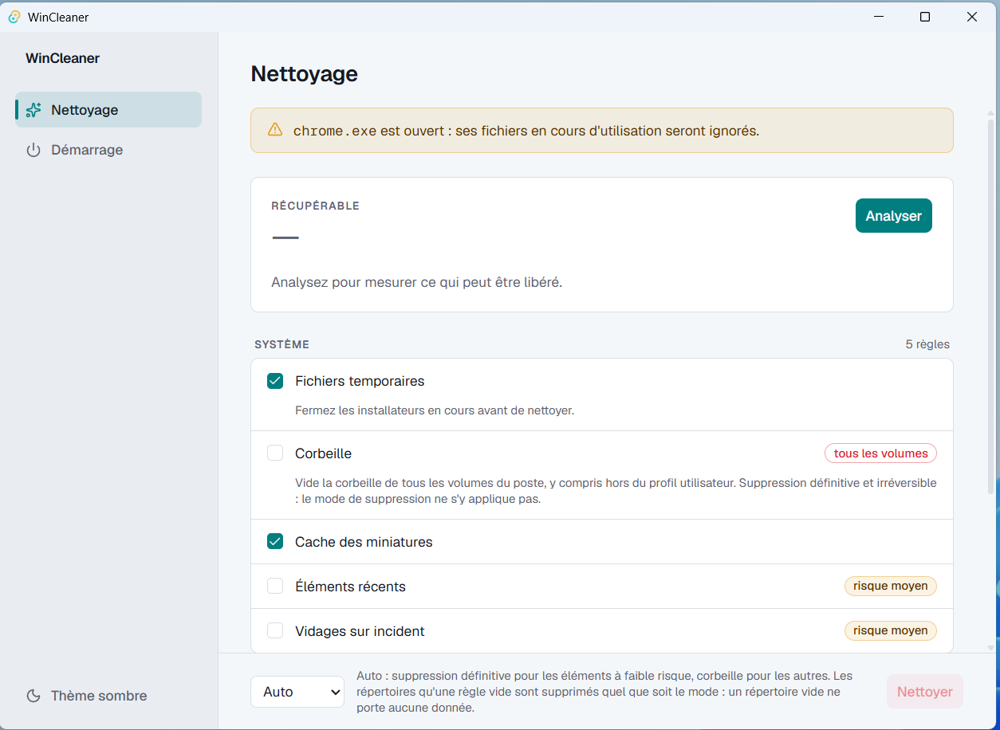

# WinCleaner

[](https://github.com/OWNER/wincleaner/actions/workflows/ci.yml)
[](LICENSE)

Un nettoyeur Windows open source qui ne fait que ce qu'il dit : pas de
télémétrie, pas d'accès réseau, pas de nettoyeur de registre.



## Ce qu'il nettoie

WinCleaner regroupe huit règles, réparties en deux catégories. Une règle
peut être décochée par défaut lorsqu'elle est irréversible ou qu'elle touche
des données curées à la main par l'utilisateur.

**Système**

- **Fichiers temporaires** (`%TEMP%`) — cochée par défaut.
- **Corbeille** — **décochée par défaut** ; voir l'exception ci-dessous.
- **Cache des miniatures** — cochée par défaut.
- **Éléments récents** — **décochée par défaut** (liste des fichiers ouverts
  récemment).
- **Vidages sur incident** (`CrashDumps`) — **décochée par défaut**.

**Navigateurs**

- **Cache Microsoft Edge** — cochée par défaut.
- **Cache Google Chrome** — cochée par défaut.
- **Cache Mozilla Firefox** — cochée par défaut.

## Garanties de sécurité

- **Aucune commande ne prend un chemin.** Le front n'envoie que des
  identifiants de règles et un mode ; le nettoyage re-scanne toujours avant
  de supprimer.
- **Confinement au profil vérifié sur le disque**, pas seulement déclaré :
  avant de parcourir une racine, et de nouveau avant chaque suppression, le
  chemin est résolu par `canonicalize` et doit rester sous le
  `%USERPROFILE%` résolu. Toute jonction, lien symbolique, point de montage
  ou espace réservé de synchronisation cloud est refusé plutôt que suivi, y
  compris à la racine.
- **Pas de nettoyeur de registre.** L'écran Démarrage écrit uniquement le
  bit d'activation d'un programme au démarrage ; il ne supprime jamais de
  valeur de registre.
- **Pas d'accès réseau.** Le CSP de l'application l'interdit
  (`connect-src 'self' ipc: http://ipc.localhost`).
- **Confirmation avant nettoyage.** Le bouton Nettoyer passe toujours par
  une boîte qui annonce le mode et énumère nommément ce que l'opération
  détruira sans retour possible.

Cette exception : la règle **Corbeille** passe par l'API Windows
`SHEmptyRecycleBinW`, qui vide la corbeille de **tous les volumes** du
poste, y compris hors du profil utilisateur. Cette suppression est
définitive, quel que soit le mode de suppression choisi. L'écran Nettoyage
le signale sur la ligne de la règle, elle est **décochée par défaut**, et
elle est toujours traitée en première position d'une passe — sans quoi elle
emporterait définitivement ce que les autres règles viennent d'y déposer en
mode « Corbeille ».

## Installation

Les binaires (MSI et NSIS) sont publiés sur la page
[Releases](https://github.com/OWNER/wincleaner/releases) du dépôt.

Ces installateurs ne sont **pas encore signés** : Windows Defender
SmartScreen affichera un avertissement, et une machine avec Smart App
Control (SAC) actif refusera de les exécuter tant que la signature n'est pas
en place. Voir `docs/signature.md` pour l'état de la mise en place de la
signature via SignPath.

## Développement — build depuis les sources

Prérequis :

- Windows 11, WebView2 installé
- Rust stable MSVC (rustup), Node 24 et npm 11
- Visual Studio 2022 avec les outils C++

```
npm install
npm run tauri dev
```

## Tests

```
npm test
cd src-tauri
cargo test -- --test-threads=1
```

Le `--test-threads=1` est obligatoire côté Rust : les tests du registre de
démarrage partagent `HKCU\Software\wincleaner-test`.

Les vérifications qui ne peuvent pas être automatisées sans détruire des
données (vidage de la corbeille, désactivation réelle d'un programme au
démarrage) sont décrites dans `docs/verification-manuelle.md` et sont à
rejouer avant chaque release.

## Build

```
npm run tauri build
```

## Contribuer

L'intégration continue (`.github/workflows/ci.yml`) tourne sur chaque pull
request vers `master` : tests front (Vitest), build front, tests Rust
(`cargo test -- --test-threads=1`) et lint (`cargo clippy`). Une pull
request doit passer ces vérifications avant relecture.

## Licence

MIT — voir `LICENSE`.
